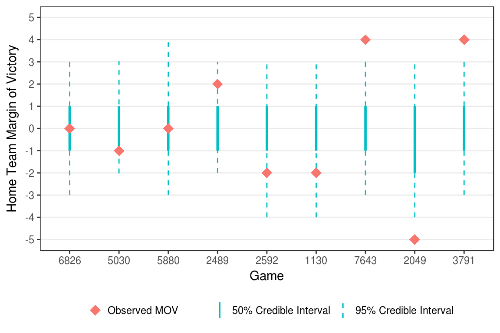

# Fitting the Model {#fit-model}

With the data gathered, the next step is to estimate the model to get ability estimates for each team. Following the findings of the simulation study in Section \@ref(simulation), the game random intercept model will be used for the estimation.


## Model estimation {#fit-real-data}

The first step is to load in the data set and do some filtering using the **dplyr** package [@R-dplyr].


```r
library(dplyr)
load("_data/full_data.rda")
```

To filter, I first remove any game that hasn't been played (or was canceled) by removing any games that don't have a score for either team. I also remove the competition field, as it is not necessary for the model estimation.


```r
fit_data <-  full_data %>%
  filter(!is.na(h_goals), !is.na(a_goals)) %>%
  select(-competition)
```

Next, I filter the data to only include teams with a least 5 games played. This is to ensure that all teams included have a sufficient number of games to get reasonable estimates. This process is done iteratively to ensure that after removing teams with less than five games, teams that orginally had more than 5 games, but now no longer meet the criteria are also excluded.


```r
filter_games <- TRUE
while(filter_games) {
  team_counts <- table(c(fit_data$home, fit_data$away)) %>% as_data_frame() %>%
    arrange(desc(n)) %>%
    filter(n >= 5) %>%
    select(team = Var1, games = n) %>%
    arrange(team) %>%
    mutate(code = seq_len(nrow(.)))
  
  fit_data <- fit_data %>%
    left_join(select(team_counts, -games), by = c("home" = "team")) %>%
    rename(home_code = code) %>%
    left_join(select(team_counts, -games), by = c("away" = "team")) %>%
    rename(away_code = code) %>%
    filter(!is.na(home_code), !is.na(away_code))
  
  new_min <- table(c(fit_data$home, fit_data$away)) %>% as.numeric() %>% min()
  if (new_min >= 5) {
    filter_games <- FALSE
  } else {
    fit_data <- fit_data %>%
      select(-home_code, -away_code)
  }
}
```

This filtering process leaves a total of 7165 games between 449 teams. The number of games for each team ranges from 5 to 58.

To estimate the model, the data has to be supplied to Stan in a list format. The names of the elements of the list should match the names of the input data specified in the Stan model (see Section \@ref(imp-gri) for Stan definition of the game random intercept model).


```r
stan_data <- list(
  num_clubs = nrow(team_counts),
  num_games = nrow(fit_data),
  home = fit_data$home_code,
  away = fit_data$away_code,
  h_goals = fit_data$h_goals,
  a_goals = fit_data$a_goals,
  homeg = fit_data$home_game
)
```

In order to later assess model fit with posterior predictive model checks, a `generated quantities` section was added to the Stan model specification.


```stan
generated quantities {
  int home_rep[num_games];
  int away_rep[num_games];
  
  for (g in 1:num_games) {
    home_rep[g] = poisson_rng(exp(mu + (eta * homeg[g]) + alpha[home[g]] +
      delta[away[g]] + gamma[g]));
    away_rep[g] = poisson_rng(exp(mu + alpha[away[g]] + delta[home[g]] +
      gamma[g]));
  }
}
```

This section attempt to replicated the original data. At each each iteration of the chain, the $\lambda$ for each score within each game is calculated using the current values of the parameters. A random Poisson is then drawn for each team using the calculated $\lambda$ values. Thus, the model is able to produce a posterior distribution for the scores of each game. These distribution can then be compared to the observed scores to see how well the model fits the data.

Finally, the model can be estimated using the Stan interface **rstan** [@R-rstan]. The model is estimated with 3 chains, each with 4000 iterations. The first 2000 iterations from each chain are discarded as burn in. Additionally, a thinning interval of 2 was used. These decisions were made to decrease computation time, and to limit the size of the result `stanfit` objects, which become quite large. This leaves 1000 iterations from each chain, for a total of 3000 iterations that will make up the final posterior distributions. As in the simulation study, the target proposal acceptance rate during the adaptation period was set to 0.99 [see Section \@ref(model-est); @stan; @stanwarn].


```r
library(rstan)

gri_stanfit <- stan(file = "_data/stan-models/gri_ppmc.stan", data = stan_data,
  chains = 3, iter = 7000, warmup = 2000, init = "random", thin = 5,
  cores = 3, algorithm = "NUTS", seed = 32011,
  control = list(adapt_delta = 0.99, max_treedepth = 15))
```


## MCMC diagnostics {#diagnostics}


After estimating the model, before the parameters can be analyzed and inferences can be made, the model has to be checked to make sure it estimated correctly and completely. This diagnostic information is critical to Markov Chain Monte Carlo estimation, as with proper estimation, no valid inferences can be made. The code used to create the plot and tables used to display the diagnostic information can be seen in Appendix \@ref(diagnostic-output).

### Convergence {#convergence}

The first check is convergence. Convergence means that the MCMC chain found the high density area of the posterior distribution, and stayed there. When multiple chains are estimated, this can be done by verifying that the estimates from each chain end up in the same place. For a single chain, this means verifying that the chain is sampling roughly the same area at the beginning of the chain (after burn in) as in the end of the chain.

One way to assess convergence is through the $\hat{R}$ statistic [@bda3; @brooks1997]. The $\hat{R}$ statistic is also known as the potential scale reduction, and is a measure of how much variance there is between chains compared to the amount of variation within chains. Gelman and Rubin [-@gelman1992] suggest that in order to conclude the model has successfully converged, all $\hat{R}$ values should be less than 1.1. 

<div class="figure" style="text-align: center">

<p class="caption">(\#fig:rhat-plot)Rhat statistics for the estimated game random intercept model.</p>
</div>

Figure \@ref(fig:rhat-plot) shows that all of the $\hat{R}$ values are below the suggested cutoff of 1.1, indicating that the model has converged.

### Efficiency {#efficiency}

The second important check for MCMC estimation is the efficiency of the sampler. In other words, it is important to check that the algorithm adequately sampled the full posterior. There are several ways this can be examined. The first is by examing the effective sample size. This diagnostic takes into account the autocorrelation in the chain to determine the 'effective' number of independent draws from the posterior. If the chain is slow moving, the draws will be highly autocorrelated, and effective sample size will be well below the total number of iterations in the chain. However, low autocorrelations would indicate that the sampler is moving around the posterior fairly quickly, and the effictive sample size will be at or near the true sample size of the posterior. The effective sample size for all parameters can been seen in Figure \@ref(fig:neff-plot).

<div class="figure" style="text-align: center">

<p class="caption">(\#fig:neff-plot)Effective sample size for the estimated game random intercept model parameters.</p>
</div>

There are also measure of efficiency that are exclusive the No U-Turn Sampler [NUTS; @nuts]. For example the Bayesian Factor of Missing Information (BFMI) gives an estimate of how well the sampler adpated and explored the posterior distribution. The BFMI ranges from 0 to 1, with 0 and 1 representing poor and excellent estimation respectively. This is calculated for the chain overall [@betancourt2016].


Table: (\#tab:diag-tab)Diagnostic statistics for the NUTS algorithm.

  Chain     BFMI     Mean Acceptance Rate    Max Treedepth 
---------  -------  ----------------------  ---------------
 Chain 1    0.920           0.983                  6       
 Chain 2    0.920           0.984                  7       
 Chain 3    0.944           0.984                  7       

The BFMI values in Table \@ref(tab:diag-tab) indicate that the sampler was able to adequately visit the posterior distributions. Additionally, Table \@ref(tab:diag-tab) shows the mean acceptance rate for each chain. As expected, these values are very close to the 0.99 that was specified when the model was estimated (`control = list(adapt_delta = 0.99)`; Section \@ref(fit-real-data)). As noted in Sections \@ref(model-est) and \@ref(fit-real-data), a target acceptance rate this high is needed to prevent divergent transitions. This occurs due to the small variances of $\alpha$, $\delta$, and $\gamma$ that are estimated. The high target acceptance rate forces the sampler to take smaller steps, keeping the variances within reasonable ranges.

The concern with setting the target acceptance this high is that for parameters with wider posteriors, the sampler will not be able to move fast enough. In the NUTS algorithm, at each iteration, the sampler looks for a place to "U-Turn" in a series of possible branches. If the sampler is terminating before the maximum possible tree depth (set to 15; see Section \@ref(fit-real-data)), then the algorithm is able to adequately find good values for the next iteration of the chain. Bumping up against the maximum allowed tree depth, or going beyond it, indicates that stepsize is too small [@stanwarn; @stanintro]. Because the Max Treedepth values in Table \@ref(tab:diag-tab) are all below the maximum specified, and the BFMI values are close to 1, there is strong evidence that the sampler was indeed able to adequately sample the posteriors.

## Model fit {#model-fit}

To assess model fit, I will use posterior predictive model checks. Posterior predictive checks involve simulating replications of the data using the values of the Markov chain, and then comparing the replicated data to the observed data [@bda3]. This means that replicated data sets take into account the uncertainty in the parameter estimates, as a new replicated data set is created at each iteration of the Markov chain. These data sets can then be used to look for systematic differences in the characterics of the observed and simulated data, often through visualizations [@gelmanhill2006].

The first step is to extract the replicated data sets from the `stanfit` object using the **purrr** [@R-purrr] and **tidyr** [@R-tidyr] packages.


```r
library(purrr)
library(tidyr)

home_rep <- rstan::extract(gri_stanfit, pars = "home_rep",
  permuted = TRUE)$home_rep
away_rep <- rstan::extract(gri_stanfit, pars = "away_rep",
  permuted = TRUE)$away_rep

home_rep <- t(home_rep) %>%
  as_data_frame() %>% as.list()
away_rep <- t(away_rep) %>%
  as_data_frame() %>% as.list()
counter <- seq_along(home_rep)

rep_data <- pmap_df(.l = list(h = home_rep, a = away_rep, c = counter),
  .f = function(h, a, c) {
    data_frame(
      replication = c,
      game = seq_len(length(h)),
      home_score = h,
      away_score = a
    )
  })
```


### Score distributions {#ppmc-score-dist}

The first posterior predictive check to be examined is the distribution of home and away scores. For each replicated data set there is a distribution of goals scored by the home and away teams. To compare to the observed data, we can plot each of these distributions, and then overlay the distribution from the observed data using **ggplot2** [@R-ggplot2]. The code for Figure \@ref(fig:plot-score-dist) can be see in Appendix \@ref(ppmc-sdp).

<div class="figure" style="text-align: center">

<p class="caption">(\#fig:plot-score-dist)Recovery of observed score distributions.</p>
</div>

Figure \@ref(fig:plot-score-dist) shows that the observed score distributions for both the home and away scores are very similar to what is seen in the replicated data sets. Thus, this provides evidence that the model is able to recover the observed distributions.

### Margin of victory intervals {#ppmc-mov-int}

It is also possible to examine the margin of victory for each game. In each of the replicated data sets, the home team's margin of victory for every game can be calculated as replicated home score minus the replicated away score. Doing this for every replication creates a posterior distribution for the home team's margin of victory in every game. From the posterior we can create credible intervals (Appendix \@ref(ppmc-mov)) and determine how often the observed margin of victory falls outside the credible interval.

<div class="figure" style="text-align: center">

<p class="caption">(\#fig:plot-mov-int)Example credible interval for game margin of victories.</p>
</div>

Figure \@ref(fig:plot-mov-int) shows examples of games where the observed margin of victory fell inside the 50% credible interval, inside the 95% credible interval, and outside both intervals. Overall, for the 7165 games included in the estimation, the observed margin of victory fell within the 50% credible interval 70.6 percent of the time and within the 95% credible 98.1 percent of the time.

### Prediction error {#ppmc-prediction}

Another posterior check that can be looked at is prediction accuracy. For each replication, whether the home team won, lost, or tied can be determined for each game. Across replications, it is then possible to look at the probability of the home teaming experiencing a given outcome in each game. The probabilities can then be compared to the observed outcome to determine how accurate the predictions were. The accuracy can be determined by using a binary loss function (was the most likely outcome the observed outcome), or a log loss function (how far from the observed outcome was the probability of that outcome).

The first step is to get the probability of the home team winning, tieing, and losing each game.


```r
outcomes <- rep_data %>%
  mutate(mov = home_score - away_score) %>%
  group_by(game) %>%
  summarize(
    win_prob = length(which(mov > 0)) / n(),
    tie_prob = length(which(mov == 0)) / n(),
    loss_prob = length(which(mov < 0)) / n()
  ) %>%
  mutate(
    most_likely = ifelse(win_prob > tie_prob & win_prob > loss_prob, "win",
      ifelse(tie_prob > win_prob & tie_prob > loss_prob, "tie", "loss"))
  ) %>%
  mutate(
    obs_mov = fit_data$h_goals - fit_data$a_goals,
    outcome = ifelse(obs_mov > 0, "win", ifelse(obs_mov == 0, "tie", "loss"))
  )
```

Using the predictions from the replicated data sets, the model gave the observed outcome the highest probability in 53.1 percent of the games.

One problem with this approach is that it doesn't take into the actual values of the probabilities. For example, take two games where the home team won. In the first game, the home team had a 60 percent chance of winning. In the second game, the home teams had a 90 percent chance of winning. In both cases, the most likely outcome matches the observed outcome, so both instances are assigned a one in the binary loss function as a correct prediction. Alternatively, we could use the log loss function to look at how far the probability was from the observed event [@altun2003]. In this example, the second game would be a better prediction, and have a lower log loss, because a probability of 0.9 is closer to the observed outcome (1) than a probability of 0.6.

The log loss for multiple games is defined in equation \@ref(eq:logloss).

\begin{equation}
logloss = - \frac{1}{N}\sum_{i=1}^N\sum_{j=1}^My_{ij}\log(p_{ij})
(\#eq:logloss)
\end{equation}

In equation \@ref(eq:logloss), $N$ is number of observations (in this case the number of games), $M$ is the number of outcomes (for soccer games this is 3: win, loss, and tie), $y_{ij}$ is a binary indicator of whether outcome $M$ occured for observation $N$ (1) or not (0), and $p_{ij}$ is the probability of outcome $M$ for observation $N$. Thus, the log loss for a set of predictions is the log of the probability of the observed outcomes, summed over all observations. In the case of perfect predictions, the probability of the observed outcome would be 1, and the log probability would be 0. This means that the closer the log loss is to 0, the better the predictions are [@roy2001].

To calculate the log loss for the estimated game random intercept model, I define a function that takes in a matrix of predictions and a matrix of outcomes.


```r
logloss <- function(pred, obs){
  eps <- 1e-15
  pred <- pmin(pmax(pred, eps), 1 - eps)
  (-1 / nrow(obs)) * sum(obs * log(pred) + (1 - obs) * log(1 - pred)) 
}
```

Then, matrices of predictions and outcomes can be created, and the log loss can be calculated.


```r
predictions <- outcomes %>%
  select(win_prob, tie_prob, loss_prob) %>%
  as.matrix()
observations <- outcomes %>%
  mutate(
    obs_win = ifelse(outcome == "win", 1, 0),
    obs_tie = ifelse(outcome == "tie", 1, 0),
    obs_loss = ifelse(outcome == "loss", 1, 0)
  ) %>%
  select(obs_win, obs_tie, obs_loss) %>%
  as.matrix()
avg_logloss <- logloss(pred = predictions, obs = observations)
```

The log loss for predictions from the replicated data sets is 1.718. Converting back to a probability scale, on average, the probability of the observed outcome was off by 0.18. In isolation, the log loss can be hard to interpret. Instead, it is often useful to compare to baseline models.


Table: (\#tab:logloss-tab)Log loss comparison to baseline models.

         Model            Log Loss 
-----------------------  ----------
 Game Random Intercept      1.72   
     Data Average           1.86   
  Equal Probabilities       1.91   
       Home Win            37.71   

Table \@ref(tab:logloss-tab) shows the log loss for a variety of models. In the data average model, the probability of each outcome is set to the overall average for the entire data set. In the equal probabilities model, the probability for each outcome is set to 0.33. Finally, in the home win model, the probability of the home team winning is set to 1 and the probability of the other outcomes is set to 0. The posterior predictive probabilities from the game random intercept model out perform all of these baseline models.

### Posterior predictive check summary

Overall, the posterior predictive model checks indicate adequate model fit. The model is able to accurately recover the distributions of scores for both the home and away teams (Figure \@ref(fig:plot-score-dist)). Additionally, when looking at individual games, the credible intervals for the margin of victory are able to consistently capture the observed margin of victory. Finally, the prediction error shows that the model's predictions are able to more accurately pick game outcomes than a variety of baseline models.

Taken in totality, there is sufficient evidence of model fit for us to proceed with the analysis and examine the posterior distributions of the parameter estimates.


## Results {#results}

A ranking of the teams can be created by the goals they would be expected to score and concede against an average team at a neutral location. The larger the difference between these expected goals, the better team. First we pull out the parameters we need from the model.


```r
params <- rstan::extract(gri_stanfit, pars = c("mu", "alpha", "delta"))
alpha <- colMeans(params$alpha)
delta <- colMeans(params$delta)
mu <- mean(params$mu)
```


Then we can compute the expected offense, defense, and margin for each team to create the rankings.


```r
rankings <- data_frame(
  Club = team_counts$team,
  Attacking = alpha,
  Defense = delta
) %>%
  mutate(
    `Expected Offense` = exp(mu + alpha),
    `Expected Defense` = exp(mu + delta),
    `Expected Margin` = `Expected Offense` - `Expected Defense`
  ) %>%
  arrange(desc(`Expected Margin`)) %>%
  mutate(
    Attacking = formatC(Attacking, digits = 3, drop0trailing = FALSE,
      format = "f"),
    Defense = formatC(Defense, digits = 3, drop0trailing = FALSE,
      format = "f"),
    `Expected Offense` = formatC(`Expected Offense`, digits = 2,
      drop0trailing = FALSE, format = "f"),
    `Expected Defense` = formatC(`Expected Defense`, digits = 2,
      drop0trailing = FALSE, format = "f"),
    `Expected Margin` = formatC(`Expected Margin`, digits = 2,
      drop0trailing = FALSE, format = "f")
  )
```

As we might expect, the top of the list is dominated by team leading the best European leagues and having success in the Champions League. Bayern Munich comes in as the top team in rankings, followed by Barcelona, Paris Saint-Germain, AS Monaco, and Real Madrid to round out the top 5. The top offense belongs to Barcelona according to the model, while FC Copenhagen boasts the best defense.


```r
DT::datatable(select(rankings, -Club), rownames = rankings$Club,
  options = list(pageLength = 10, scrollX = TRUE,
  columnDefs = list(list(className = 'dt-center', targets = 1:5))),
  caption = "Club rankings from game random intercept model")
```

<!--html_preserve--><div id="htmlwidget-27bd867acf4efb0774ff" style="width:100%;height:auto;" class="datatables html-widget"></div>
<script type="application/json" data-for="htmlwidget-27bd867acf4efb0774ff">{"x":{"filter":"none","caption":"<caption>Club rankings from game random intercept model<\/caption>","data":[["Bayern Munich","Barcelona","Paris Saint-Germain","AS Monaco","Real Madrid","Chelsea","Tottenham Hotspur","Arsenal","Manchester City","Liverpool","Celtic","Juventus","Borussia Dortmund","AS Roma","Feyenoord Rotterdam","FC Porto","FC Copenhagen","Manchester United","Ajax Amsterdam","Napoli","Atletico Madrid","Shakhtar Donetsk","Anderlecht","PSV Eindhoven","Benfica","Lyon","Newcastle United","FC Salzburg","FC Basel","Zenit St Petersburg","Besiktas","Brighton &amp; Hove Albion","TSG Hoffenheim","Everton","RB Leipzig","Brøndby","Fenerbahce","Istanbul Buyuksehir BSK","Lincoln City","Olympiakos","Norwich City","Aberdeen","Lazio","Schalke 04","Fulham","Sevilla FC","Spartak Moscow","Atalanta","Rostov","Sporting CP","Tranmere","Levante","Club Brugge","Torino","PAOK Salonika","Luton Town","Fiorentina","Hannover 96","Galatasaray","Young Boys","Sheff Utd","Internazionale","Borussia Monchengladbach","AC Milan","Spal","KAA Gent","Nice","Villarreal","Lens","Eibar","KV Oostende","VfB Stuttgart","Celta Vigo","Panathinaikos","Racing Genk","Braga","Dover","Bayer Leverkusen","FC Utrecht","Bolton Wanderers","FC Midtjylland","Leeds United","CSKA Moscow","Dagenham &amp; Redbridge","FC Cologne","Rangers","Southampton","TSV Eintracht Braunschweig","Marseille","Hertha Berlin","FC Union Berlin","Standard Liege","Krasnodar","Lokomotiv Moscow","Dynamo Kiev","Real Sociedad","Aldershot","Zulte-Waregem","Vitesse Arnhem","Preston North End","Plymouth Argyle","Barrow","Brentford","Hibernian","Dynamo Dresden","Huddersfield Town","Guimaraes","Gateshead","Sheffield Wednesday","F Green","Blackpool","Hellas Verona","Halifax","Girona","Derby County","Nimes","Athletic Bilbao","Strasbourg","Leicester City","Espanyol","Benevento","Portsmouth","Barnsley","West Bromwich Albion","Bradford","Doncaster","Apoel Nicosia","Huesca","Millwall","Perugia","Frosinone","Las Palmas","SC Amiens","Troyes","Reading","Middlesbrough","Heerenveen","Bordeaux","Scunthorpe","Austria Vienna","OSM","Oxford United","FC Sion","Exeter City","Toulouse","SC Rheindorf","Werder Bremen","Crystal Palace","Aston Villa","St Etienne","Wycombe Wanderers","Lugo","Le Havre AC","Royal Charleroi SC","Sampdoria","Eintracht Frankfurt","Fleetwood Town","Rapid Vienna","Real Valladolid","Heidenheimer SB","Colchester","Cádiz","Elche","Wolverhampton Wanderers","Virtus Entel","Udinese","FC Nordsjaelland","FK Rubin Kazan","Burnley","Cardiff City","Getafe","Trabzonspor","Alavés","Stade de Reims","Brest","Hapoel Be'e","Heart of Midlothian","Tenerife","Stevenage","Rochdale","Kasimpasa","Guingamp","Cambridge United","GFC Ajaccio","Accrington Stanley","Bristol City","Ludogorets","AFC Bournemouth","SK Sturm Gra","FK Amkar Perm","Macclesfield Town","St Johnstone","Cittadella","Swansea City","York","Steaua Bucuresti","R Zaragoza","AEK Athens","Grimsby","Lucerne","Almeria","Valencia","Spezia","Mainz","Maritimo","Sochaux","Randers FC","Terek Grozny","Stoke City","Hull City","Antalyaspor","Evian Thonon Gaillard","Carlisle","Salernitana","Cesena","FC Xanthi","Liberec","Panionios","SV Sandhausen","Chievo Verona","Morton","Bourg-Peronnas","FC Groningen","Rayo","Vitoria Setubal","AFC Wimbledon","Platanias","GD Chaves","Alanyaspor K","Sevilla At.","Lyngby","FC Twente","Clermont Foot","Partick Thistle","Genclerbirligi","Angers","Queens Park Rangers","FC Zürich","AZ Alkmaar","Ipswich Town","Nottingham Forest","Valenciennes","Blackburn Rovers","Mansfield","Mallorca","Würzburger Kickers","Sassuolo","Maccabi Tel-Aviv","Niort","Rio Ave","Bari","Watford","SC Freiburg","West Ham United","Boavista","FC Zorya Luh","Boreham Wood","FC Ufa","Southend","Bristol Rovers","Charlton Athletic","KV Kortrijk","FC Astana","Numancia","Kaiserslautern","Milton Keynes Dons","St. Truiden","Novara","Eastleigh","Sparta Prague","Lausanne Spo","Nurnberg","Lille","Sonderjyske","Carpi","Viktoria Plzen","Dijon FCO","AaB","Atromitos","VfL Wolfsburg","Birmingham City","VfL Bochum","Fortuna Düsseldorf","KV Mechelen","FK Qarabag","Karabükspor","FK Astra Giu","Konyaspor","Tours","Bursaspor","Reus Deporti","Málaga","Bologna","SpVgg Greuther Furth","FC Ingolstadt 04","TSV 1860 Munich","UCAM Murcia","Sutton United","Krylia Sovetov","SC Heracles Almelo","Walsall","Pisa","Peterborough United","Montpellier","Deportivo La Coruña","Anzhi Makhachkala","Barnet","Larissa FC","AJ Auxerre","Ascoli","Guiseley","Arminia Bielefeld","AS Nancy Lorraine","St Pauli","Burton Albion","Legia Warsaw","AD Alcorcon","Dundalk","Iraklis","Eupen","Cordoba","St. Pölten","Cagliari","AGF Aarhus","Chester FC","Odense Boldk","Orléans","Cork","AC Ajaccio","Oldham","St Gallen","Sparta Rotterdam","Orenburg","FC Augsburg","Hamburg SV","Gimnastic de Tarragona","Admira Wacke","Northampton Town","Real Oviedo","Nantes","Wrexham","Yeovil Town","FK Qabala","Panetolikos","FC Lugano","Stade Rennes","Trapani","Latina","Kayserispor","FC Thun","Pro Vercelli","Real Betis","Stade Laval","Pas Giannina","Torquay","Wigan Athletic","Mattersburg","US Avellino","Belenenses","Cheltenham Town","Kerkyra","Lokeren","Viitorul Con","Asteras Trip","Viborg FF","RZ Pellets W","Paços de Ferreira","FC Erzgebirge Aue","Dinamo Zagreb","Genoa","Estoril","Akhisar","Brescia","Red Star FC 93","Willem II Tilburg","Grasshoppers","Crawley Town","Leganes","Waasland-Bev","Maidstone United","Lorient","Bury","Sunderland","Ural","Arouca","Gillingham","Caykur Rizespor","Ternana","Levadiakos","Newport County","Vicenza","Esbjerg FB","Notts County","Shrewsbury Town","Dundee","Woking","Solihull Moors","Crewe","Ross County","Gaziantepspor","Swindon Town","FC Arsenal T","Feirense","Port Vale","Bromley","Sporting Gijón","Excelsior","Crotone","Braintree Town","Caen","Mirandes","Hartlepool","AC Horsens","Moreirense","Bastia","PEC Zwolle","Morecambe","Kilmarnock","Silkeborg IF","Empoli","ADO Den Haag","SV Josko Rie","Coventry City","Hamilton Academical","Roda JC Kerkrade","Karlsruher SC","NEC Nijmegen","Veria","L Orient","Metz","Chesterfield","Adanaspor","CD Nacional de Madeira","Westerlo","US Pescara","Inverness Caledonian Thistle","Motherwell","Mouscron-Per","Osasuna","FC Vaduz","Granada","SV Darmstadt 98","Palermo","Go Ahead Eagles","Southport","Tondela","Rotherham United","FK Tom Tomsk","North Ferrib"],["0.702","0.758","0.609","0.668","0.663","0.543","0.509","0.592","0.522","0.499","0.517","0.415","0.522","0.491","0.458","0.395","0.319","0.370","0.400","0.491","0.298","0.416","0.432","0.330","0.337","0.444","0.342","0.316","0.355","0.372","0.386","0.306","0.286","0.286","0.299","0.304","0.259","0.251","0.282","0.164","0.421","0.217","0.260","0.225","0.338","0.232","0.228","0.217","0.102","0.237","0.185","0.237","0.190","0.351","0.097","0.206","0.234","0.232","0.293","0.288","0.194","0.280","0.159","0.154","0.204","0.153","0.143","0.045","0.169","0.226","0.201","0.195","0.190","0.078","0.178","0.158","0.315","0.193","0.145","0.063","0.202","0.052","0.019","0.167","0.136","0.100","0.023","0.106","0.135","0.083","0.112","0.150","0.062","0.019","0.065","0.171","0.053","0.158","0.128","0.161","0.044","0.087","0.204","0.029","0.155","0.046","0.130","0.033","0.023","0.102","0.069","0.133","0.123","0.121","-0.013","0.104","0.054","0.157","0.161","0.065","0.034","0.096","0.125","0.053","-0.035","0.109","-0.002","0.014","0.114","0.077","0.017","0.213","0.031","0.102","0.131","-0.075","0.153","0.104","0.129","0.263","0.022","0.120","0.194","0.110","-0.083","0.136","0.194","0.095","-0.096","-0.156","0.059","0.096","-0.101","-0.109","-0.013","-0.133","-0.023","0.010","-0.014","0.006","0.076","0.066","0.028","0.015","0.061","0.039","0.165","-0.034","-0.075","0.079","-0.030","-0.084","-0.135","-0.075","-0.004","-0.071","0.119","-0.050","0.133","0.131","0.059","0.026","-0.019","-0.049","-0.024","0.026","0.040","0.130","-0.050","-0.167","-0.012","-0.011","0.036","0.149","0.082","-0.041","-0.038","-0.078","-0.099","0.156","-0.009","0.167","-0.144","0.080","-0.154","-0.189","-0.022","-0.018","-0.035","0.053","-0.062","-0.081","0.048","-0.130","-0.016","-0.132","0.055","-0.132","-0.009","-0.049","-0.001","0.081","0.022","-0.127","-0.168","-0.021","0.016","-0.100","0.206","-0.120","-0.216","0.012","-0.088","-0.155","-0.184","-0.074","-0.052","-0.076","0.102","-0.161","0.086","-0.052","-0.019","-0.078","-0.094","-0.183","0.027","-0.111","-0.008","-0.070","-0.143","-0.030","0.051","0.073","-0.154","-0.172","-0.184","-0.299","-0.035","0.042","-0.124","0.162","-0.066","-0.088","-0.282","0.003","-0.010","-0.099","-0.008","-0.067","0.098","0.070","-0.187","-0.074","-0.224","-0.104","0.006","-0.208","-0.045","-0.158","-0.118","-0.073","-0.104","-0.032","-0.068","-0.087","-0.144","-0.120","0.020","-0.133","-0.200","-0.033","-0.118","-0.136","-0.084","-0.101","-0.091","-0.086","-0.130","0.026","-0.093","-0.426","-0.009","0.098","-0.073","-0.233","-0.080","-0.197","-0.226","-0.066","-0.167","0.016","-0.282","-0.226","-0.144","0.027","-0.351","-0.178","-0.139","0.078","-0.140","-0.127","0.093","-0.128","0.065","-0.206","-0.182","-0.123","-0.066","-0.324","-0.142","0.019","-0.188","-0.153","-0.079","-0.132","-0.196","0.046","-0.043","-0.172","-0.250","-0.097","-0.093","-0.135","-0.007","-0.232","-0.134","-0.243","0.022","0.043","-0.249","-0.150","-0.310","-0.218","-0.124","-0.303","-0.181","-0.174","-0.296","-0.147","-0.192","-0.385","-0.094","-0.041","-0.203","-0.145","-0.194","-0.137","-0.218","-0.100","-0.288","-0.281","-0.100","-0.204","-0.299","-0.154","-0.100","-0.263","-0.259","-0.049","-0.002","0.043","-0.257","-0.218","-0.176","-0.003","-0.149","-0.201","-0.228","-0.146","-0.303","-0.128","-0.100","-0.218","-0.164","0.028","-0.004","-0.082","-0.157","-0.154","-0.214","-0.335","-0.218","-0.224","-0.267","-0.134","-0.071","-0.287","-0.115","-0.144","-0.159","-0.160","-0.130","-0.227","-0.286","-0.114","0.029","-0.269","-0.093","-0.417","-0.164","-0.147","-0.238","-0.290","-0.400","-0.330","-0.235","-0.131","-0.171","-0.241","-0.189","-0.263","-0.338","-0.098","-0.139","-0.160","-0.162","-0.257","-0.182","-0.104","-0.259","-0.320","-0.285","-0.208","-0.105","-0.364","-0.193","-0.365","-0.433"],["-0.473","-0.254","-0.378","-0.175","-0.123","-0.336","-0.390","-0.153","-0.264","-0.263","-0.213","-0.427","-0.176","-0.222","-0.284","-0.421","-0.517","-0.397","-0.308","-0.116","-0.439","-0.185","-0.150","-0.313","-0.289","-0.087","-0.267","-0.282","-0.209","-0.170","-0.117","-0.244","-0.202","-0.187","-0.165","-0.142","-0.207","-0.205","-0.150","-0.329","0.068","-0.233","-0.164","-0.208","-0.022","-0.132","-0.131","-0.140","-0.298","-0.100","-0.166","-0.092","-0.155","0.070","-0.265","-0.107","-0.064","-0.057","0.029","0.025","-0.095","0.024","-0.130","-0.132","-0.063","-0.128","-0.141","-0.269","-0.090","-0.016","-0.047","-0.053","-0.057","-0.197","-0.067","-0.090","0.110","-0.039","-0.098","-0.203","-0.022","-0.211","-0.249","-0.058","-0.089","-0.134","-0.229","-0.122","-0.083","-0.148","-0.108","-0.061","-0.167","-0.217","-0.151","-0.019","-0.162","-0.032","-0.066","-0.025","-0.162","-0.098","0.042","-0.164","-0.011","-0.140","-0.034","-0.148","-0.156","-0.060","-0.098","-0.022","-0.028","-0.026","-0.182","-0.041","-0.099","0.024","0.029","-0.080","-0.113","-0.041","-0.007","-0.082","-0.183","-0.013","-0.133","-0.114","0.002","-0.038","-0.106","0.114","-0.087","-0.006","0.029","-0.188","0.065","0.012","0.041","0.186","-0.074","0.034","0.115","0.025","-0.182","0.063","0.125","0.021","-0.184","-0.250","-0.014","0.027","-0.183","-0.192","-0.086","-0.211","-0.090","-0.055","-0.078","-0.055","0.020","0.009","-0.031","-0.044","0.005","-0.016","0.117","-0.091","-0.134","0.029","-0.086","-0.140","-0.194","-0.128","-0.051","-0.117","0.082","-0.093","0.098","0.100","0.029","-0.003","-0.049","-0.079","-0.052","0.001","0.015","0.108","-0.077","-0.193","-0.028","-0.024","0.024","0.142","0.077","-0.043","-0.040","-0.075","-0.094","0.160","-0.004","0.172","-0.137","0.087","-0.145","-0.179","-0.013","-0.009","-0.024","0.064","-0.049","-0.066","0.063","-0.111","0.003","-0.106","0.077","-0.104","0.017","-0.020","0.032","0.113","0.056","-0.088","-0.122","0.019","0.056","-0.053","0.241","-0.068","-0.159","0.059","-0.036","-0.100","-0.126","-0.022","0.000","-0.023","0.150","-0.096","0.137","0.007","0.040","-0.014","-0.028","-0.109","0.089","-0.039","0.057","-0.001","-0.068","0.038","0.115","0.137","-0.070","-0.083","-0.095","-0.197","0.046","0.118","-0.034","0.230","0.020","0.001","-0.174","0.088","0.076","-0.003","0.081","0.028","0.183","0.158","-0.070","0.033","-0.100","0.008","0.108","-0.083","0.062","-0.038","-0.002","0.042","0.015","0.080","0.050","0.034","-0.017","0.004","0.130","-0.006","-0.064","0.083","0.009","-0.004","0.046","0.036","0.045","0.051","0.017","0.154","0.051","-0.230","0.125","0.221","0.076","-0.061","0.070","-0.030","-0.054","0.082","-0.002","0.157","-0.095","-0.048","0.021","0.171","-0.142","0.011","0.044","0.229","0.044","0.059","0.246","0.059","0.224","-0.002","0.021","0.073","0.121","-0.088","0.061","0.196","0.028","0.057","0.117","0.074","0.025","0.226","0.154","0.052","-0.007","0.116","0.120","0.087","0.192","0.012","0.092","0.006","0.221","0.240","0.006","0.086","-0.038","0.033","0.110","-0.028","0.067","0.075","-0.017","0.100","0.065","-0.078","0.147","0.190","0.064","0.112","0.080","0.126","0.067","0.158","0.018","0.024","0.166","0.087","0.025","0.132","0.174","0.053","0.061","0.219","0.257","0.292","0.069","0.100","0.132","0.262","0.155","0.119","0.103","0.164","0.051","0.177","0.199","0.113","0.155","0.298","0.277","0.220","0.171","0.179","0.143","0.061","0.144","0.141","0.115","0.211","0.256","0.107","0.227","0.207","0.196","0.200","0.221","0.155","0.118","0.237","0.340","0.132","0.258","0.056","0.221","0.241","0.181","0.156","0.091","0.141","0.202","0.275","0.251","0.206","0.250","0.204","0.167","0.321","0.298","0.288","0.300","0.248","0.296","0.348","0.253","0.223","0.245","0.296","0.368","0.225","0.414","0.339","0.311"],["2.16","2.28","1.97","2.09","2.08","1.84","1.78","1.93","1.80","1.76","1.79","1.62","1.80","1.75","1.69","1.59","1.47","1.55","1.60","1.75","1.44","1.62","1.65","1.49","1.50","1.67","1.51","1.47","1.52","1.55","1.57","1.45","1.42","1.42","1.44","1.45","1.39","1.37","1.42","1.26","1.63","1.33","1.39","1.34","1.50","1.35","1.34","1.33","1.18","1.36","1.29","1.36","1.29","1.52","1.18","1.31","1.35","1.35","1.43","1.43","1.30","1.42","1.25","1.25","1.31","1.25","1.23","1.12","1.27","1.34","1.31","1.30","1.29","1.16","1.28","1.25","1.47","1.30","1.24","1.14","1.31","1.13","1.09","1.26","1.23","1.18","1.09","1.19","1.22","1.16","1.20","1.24","1.14","1.09","1.14","1.27","1.13","1.25","1.22","1.26","1.12","1.17","1.31","1.10","1.25","1.12","1.22","1.10","1.09","1.18","1.15","1.22","1.21","1.21","1.06","1.19","1.13","1.25","1.26","1.14","1.11","1.18","1.21","1.13","1.03","1.19","1.07","1.08","1.20","1.16","1.09","1.32","1.10","1.18","1.22","0.99","1.25","1.19","1.22","1.39","1.09","1.21","1.30","1.19","0.98","1.23","1.30","1.18","0.97","0.91","1.13","1.18","0.97","0.96","1.06","0.94","1.04","1.08","1.05","1.08","1.15","1.14","1.10","1.09","1.14","1.11","1.26","1.03","0.99","1.16","1.04","0.98","0.93","0.99","1.06","1.00","1.20","1.02","1.22","1.22","1.13","1.10","1.05","1.02","1.04","1.10","1.11","1.22","1.02","0.90","1.06","1.06","1.11","1.24","1.16","1.03","1.03","0.99","0.97","1.25","1.06","1.26","0.93","1.16","0.92","0.89","1.05","1.05","1.03","1.13","1.01","0.99","1.12","0.94","1.05","0.94","1.13","0.94","1.06","1.02","1.07","1.16","1.09","0.94","0.90","1.05","1.09","0.97","1.31","0.95","0.86","1.08","0.98","0.92","0.89","0.99","1.02","0.99","1.18","0.91","1.17","1.02","1.05","0.99","0.97","0.89","1.10","0.96","1.06","1.00","0.93","1.04","1.13","1.15","0.92","0.90","0.89","0.79","1.03","1.12","0.95","1.26","1.00","0.98","0.81","1.07","1.06","0.97","1.06","1.00","1.18","1.15","0.89","0.99","0.85","0.96","1.08","0.87","1.02","0.91","0.95","0.99","0.96","1.04","1.00","0.98","0.93","0.95","1.09","0.94","0.88","1.03","0.95","0.93","0.98","0.97","0.98","0.98","0.94","1.10","0.97","0.70","1.06","1.18","0.99","0.85","0.99","0.88","0.85","1.00","0.91","1.09","0.81","0.85","0.93","1.10","0.75","0.89","0.93","1.16","0.93","0.94","1.17","0.94","1.14","0.87","0.89","0.95","1.00","0.77","0.93","1.09","0.89","0.92","0.99","0.94","0.88","1.12","1.02","0.90","0.83","0.97","0.97","0.93","1.06","0.85","0.94","0.84","1.09","1.12","0.83","0.92","0.78","0.86","0.95","0.79","0.89","0.90","0.80","0.92","0.88","0.73","0.97","1.03","0.87","0.92","0.88","0.93","0.86","0.97","0.80","0.81","0.97","0.87","0.79","0.92","0.97","0.82","0.83","1.02","1.07","1.12","0.83","0.86","0.90","1.07","0.92","0.87","0.85","0.92","0.79","0.94","0.97","0.86","0.91","1.10","1.06","0.99","0.91","0.92","0.86","0.77","0.86","0.85","0.82","0.94","1.00","0.80","0.95","0.93","0.91","0.91","0.94","0.85","0.80","0.95","1.10","0.82","0.97","0.71","0.91","0.92","0.84","0.80","0.72","0.77","0.85","0.94","0.90","0.84","0.89","0.82","0.76","0.97","0.93","0.91","0.91","0.83","0.89","0.96","0.83","0.78","0.80","0.87","0.96","0.74","0.88","0.74","0.69"],["0.67","0.83","0.73","0.90","0.95","0.76","0.72","0.92","0.82","0.82","0.86","0.70","0.90","0.86","0.80","0.70","0.64","0.72","0.79","0.95","0.69","0.89","0.92","0.78","0.80","0.98","0.82","0.81","0.87","0.90","0.95","0.84","0.87","0.89","0.91","0.93","0.87","0.87","0.92","0.77","1.14","0.85","0.91","0.87","1.05","0.94","0.94","0.93","0.79","0.97","0.91","0.98","0.92","1.15","0.82","0.96","1.00","1.01","1.10","1.10","0.97","1.10","0.94","0.94","1.00","0.94","0.93","0.82","0.98","1.05","1.02","1.01","1.01","0.88","1.00","0.98","1.19","1.03","0.97","0.87","1.05","0.87","0.83","1.01","0.98","0.94","0.85","0.95","0.98","0.92","0.96","1.01","0.91","0.86","0.92","1.05","0.91","1.04","1.00","1.04","0.91","0.97","1.12","0.91","1.06","0.93","1.03","0.92","0.91","1.01","0.97","1.05","1.04","1.04","0.89","1.03","0.97","1.10","1.10","0.99","0.95","1.03","1.06","0.99","0.89","1.06","0.94","0.95","1.07","1.03","0.96","1.20","0.98","1.06","1.10","0.89","1.14","1.08","1.11","1.29","0.99","1.11","1.20","1.10","0.89","1.14","1.21","1.09","0.89","0.83","1.05","1.10","0.89","0.88","0.98","0.87","0.98","1.01","0.99","1.01","1.09","1.08","1.04","1.02","1.08","1.05","1.20","0.98","0.94","1.10","0.98","0.93","0.88","0.94","1.02","0.95","1.16","0.97","1.18","1.18","1.10","1.07","1.02","0.99","1.02","1.07","1.09","1.19","0.99","0.88","1.04","1.04","1.10","1.23","1.15","1.02","1.03","0.99","0.97","1.25","1.06","1.27","0.93","1.17","0.92","0.89","1.06","1.06","1.04","1.14","1.02","1.00","1.14","0.96","1.07","0.96","1.16","0.96","1.09","1.05","1.10","1.20","1.13","0.98","0.95","1.09","1.13","1.01","1.36","1.00","0.91","1.13","1.03","0.97","0.94","1.05","1.07","1.05","1.24","0.97","1.23","1.08","1.11","1.05","1.04","0.96","1.17","1.03","1.13","1.07","1.00","1.11","1.20","1.23","1.00","0.98","0.97","0.88","1.12","1.20","1.03","1.35","1.09","1.07","0.90","1.17","1.15","1.07","1.16","1.10","1.28","1.25","1.00","1.11","0.97","1.08","1.19","0.98","1.14","1.03","1.07","1.12","1.09","1.16","1.12","1.11","1.05","1.07","1.22","1.06","1.00","1.16","1.08","1.07","1.12","1.11","1.12","1.13","1.09","1.25","1.13","0.85","1.21","1.33","1.15","1.01","1.15","1.04","1.01","1.16","1.07","1.25","0.97","1.02","1.09","1.27","0.93","1.08","1.12","1.34","1.12","1.13","1.37","1.13","1.34","1.07","1.09","1.15","1.21","0.98","1.14","1.30","1.10","1.13","1.20","1.15","1.10","1.34","1.25","1.13","1.06","1.20","1.21","1.17","1.30","1.08","1.17","1.08","1.33","1.36","1.08","1.17","1.03","1.11","1.19","1.04","1.14","1.15","1.05","1.18","1.14","0.99","1.24","1.29","1.14","1.20","1.16","1.21","1.14","1.25","1.09","1.10","1.26","1.17","1.10","1.22","1.27","1.13","1.14","1.33","1.38","1.43","1.15","1.18","1.22","1.39","1.25","1.20","1.18","1.26","1.13","1.28","1.30","1.20","1.25","1.44","1.41","1.33","1.27","1.28","1.23","1.14","1.24","1.23","1.20","1.32","1.38","1.19","1.34","1.32","1.30","1.31","1.33","1.25","1.20","1.35","1.50","1.22","1.38","1.13","1.33","1.36","1.28","1.25","1.17","1.23","1.31","1.41","1.37","1.31","1.37","1.31","1.26","1.47","1.44","1.43","1.44","1.37","1.44","1.51","1.38","1.34","1.37","1.44","1.55","1.34","1.62","1.50","1.46"],["1.49","1.45","1.23","1.19","1.13","1.08","1.06","1.02","0.98","0.94","0.93","0.92","0.91","0.89","0.89","0.89","0.83","0.83","0.81","0.79","0.75","0.73","0.73","0.70","0.70","0.69","0.69","0.66","0.66","0.65","0.62","0.61","0.55","0.54","0.54","0.52","0.52","0.50","0.50","0.49","0.49","0.48","0.48","0.47","0.45","0.41","0.40","0.40","0.39","0.39","0.38","0.38","0.38","0.37","0.36","0.35","0.35","0.34","0.33","0.33","0.33","0.32","0.31","0.31","0.31","0.31","0.30","0.30","0.29","0.29","0.29","0.29","0.28","0.28","0.28","0.28","0.27","0.27","0.27","0.27","0.26","0.26","0.26","0.25","0.25","0.25","0.24","0.24","0.24","0.24","0.24","0.24","0.23","0.23","0.22","0.22","0.22","0.22","0.21","0.21","0.21","0.20","0.20","0.19","0.19","0.19","0.18","0.18","0.18","0.18","0.18","0.18","0.17","0.16","0.16","0.16","0.16","0.16","0.15","0.15","0.15","0.15","0.15","0.14","0.14","0.14","0.13","0.13","0.13","0.13","0.13","0.12","0.12","0.12","0.12","0.11","0.10","0.10","0.10","0.10","0.10","0.10","0.10","0.10","0.09","0.09","0.09","0.08","0.08","0.08","0.08","0.08","0.08","0.08","0.07","0.07","0.07","0.07","0.07","0.06","0.06","0.06","0.06","0.06","0.06","0.06","0.06","0.06","0.06","0.06","0.06","0.05","0.05","0.05","0.05","0.05","0.04","0.04","0.04","0.04","0.03","0.03","0.03","0.03","0.03","0.03","0.03","0.03","0.03","0.02","0.02","0.01","0.01","0.01","0.01","0.00","0.00","-0.00","-0.00","-0.00","-0.00","-0.01","-0.01","-0.01","-0.01","-0.01","-0.01","-0.01","-0.01","-0.01","-0.01","-0.02","-0.02","-0.02","-0.02","-0.02","-0.03","-0.03","-0.03","-0.03","-0.04","-0.04","-0.04","-0.04","-0.04","-0.04","-0.04","-0.05","-0.05","-0.05","-0.05","-0.05","-0.05","-0.05","-0.05","-0.05","-0.05","-0.05","-0.06","-0.06","-0.06","-0.06","-0.06","-0.07","-0.07","-0.07","-0.07","-0.07","-0.07","-0.07","-0.07","-0.07","-0.07","-0.08","-0.08","-0.08","-0.08","-0.09","-0.09","-0.09","-0.09","-0.09","-0.09","-0.09","-0.09","-0.09","-0.10","-0.10","-0.10","-0.10","-0.11","-0.11","-0.11","-0.11","-0.11","-0.11","-0.12","-0.12","-0.12","-0.12","-0.12","-0.12","-0.12","-0.12","-0.12","-0.13","-0.13","-0.13","-0.13","-0.13","-0.13","-0.13","-0.13","-0.13","-0.14","-0.14","-0.14","-0.14","-0.15","-0.15","-0.15","-0.15","-0.15","-0.15","-0.16","-0.16","-0.16","-0.16","-0.16","-0.16","-0.16","-0.16","-0.17","-0.17","-0.17","-0.17","-0.18","-0.19","-0.19","-0.19","-0.19","-0.19","-0.19","-0.19","-0.20","-0.20","-0.20","-0.20","-0.21","-0.21","-0.21","-0.21","-0.21","-0.21","-0.21","-0.21","-0.22","-0.22","-0.22","-0.23","-0.23","-0.23","-0.23","-0.23","-0.23","-0.23","-0.24","-0.24","-0.24","-0.24","-0.24","-0.24","-0.25","-0.25","-0.25","-0.25","-0.25","-0.25","-0.26","-0.26","-0.26","-0.26","-0.27","-0.27","-0.27","-0.27","-0.28","-0.28","-0.28","-0.28","-0.29","-0.29","-0.29","-0.29","-0.30","-0.30","-0.30","-0.31","-0.31","-0.31","-0.31","-0.32","-0.32","-0.32","-0.32","-0.32","-0.33","-0.33","-0.33","-0.34","-0.34","-0.34","-0.34","-0.34","-0.34","-0.34","-0.35","-0.35","-0.35","-0.36","-0.37","-0.37","-0.38","-0.38","-0.38","-0.39","-0.39","-0.39","-0.39","-0.39","-0.39","-0.39","-0.40","-0.40","-0.40","-0.40","-0.40","-0.40","-0.41","-0.43","-0.43","-0.44","-0.44","-0.45","-0.45","-0.46","-0.46","-0.47","-0.47","-0.47","-0.49","-0.49","-0.50","-0.50","-0.51","-0.51","-0.53","-0.54","-0.55","-0.55","-0.55","-0.56","-0.56","-0.57","-0.58","-0.60","-0.74","-0.76","-0.77"]],"container":"<table class=\"display\">\n  <thead>\n    <tr>\n      <th> <\/th>\n      <th>Attacking<\/th>\n      <th>Defense<\/th>\n      <th>Expected Offense<\/th>\n      <th>Expected Defense<\/th>\n      <th>Expected Margin<\/th>\n    <\/tr>\n  <\/thead>\n<\/table>","options":{"pageLength":10,"scrollX":true,"columnDefs":[{"className":"dt-center","targets":[1,2,3,4,5]},{"orderable":false,"targets":0}],"order":[],"autoWidth":false,"orderClasses":false}},"evals":[],"jsHooks":[]}</script><!--/html_preserve-->
