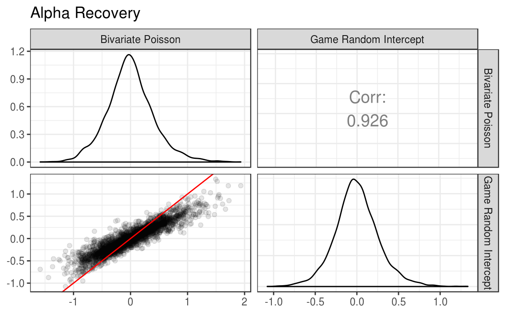
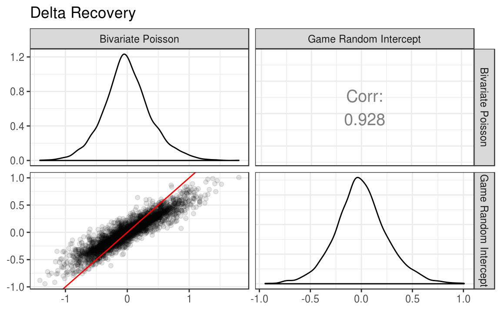

# Simulation Study {#simulation}

In order to evaluate these two models, I conducted a small scale simulation study. I generated 100 data sets from each of the bivariate Poisson and game random intercept models (for 200 data sets total). For each data set, both of the models were estimated to determine how well they were able to recover the attacking and defensive parameters for each team when the data generating model did and did not match the model.

## Data generation

Data was simulated to mimic the major domestic European leagues. For each data set, 20 clubs were generated, with each club playing all other clubs twice, once at home, and once away, for a total of 380 games.

For both data generating models, $\alpha$ and $\delta$ parameters were drawn from a $\mathcal{N}(0,0.35)$. Both $\rho$ in the bivariate Poisson and $\gamma$ in the game random intercept model were sampled from a $\mathcal{N}(0,0.1)$ distribution. For all models, $\mu$ was set to 0, and $\eta$ was set to 0.5. These distributions were based on preliminary analyses using the 2015-16 English Premier League data.

For each game, $\lambda$ values were calculated based on the parameters that were generated for each team (and game for the game random intercept model). Scores were then randomly generated using the `rpois()` function. Full data generation functions can be see in Appendix \@ref(bivpois-generate) and \@ref(gri-generate). When simulating the data sets, the **portableParallelSeeds** package was used to ensure that the data generation was completely replicable, and that the random number streams were not overlapping [@R-portableParallelSeeds].

## Model estimation {#model-est}

In total, 200 data sets were generated: 100 from the bivariate Poisson, and 100 from the game random intercept model. For each data set, both the bivariate Poisson and game random intercept model were estimated. Thus, each model was estimated 100 times on a data set from the matching data generation method, and 100 times on mis-matched data.

For each estimation, 2 chains were run with 15000 iterations. The first 5000 iterations of each chain were discarded for burnin. This resulted in a total of 20000 retained iterations that made up the final posterior distributions. The thinning interval was set to 1 (no thinning). Finally, the target proposal acceptance rate during the adaptation period was set to 0.99. This forces the algorithm to take smaller steps, which decreases efficiency. However, this also helps to eliminate divergent transitions, which are common when parameter estimates are close to their bounds, such as a variance very close to 0 [@stan; @stanwarn]. The full model estimation function can be seen in Appendix \@ref(estimate-fun).

## Running the simulation

The following code was used to run the simulation. I first define the total number of replications and the number of random streams needed for each replication. I then use **portableParallelSeeds** [@R-portableParallelSeeds] to create seeds for each replication, and save them. Data sets are then generated from each model, with the number of data sets from each model being equal to half of the total number of replications specified by `n_reps`. Finally, I create one list that contains all of the data sets, `simulation_data`, and map the simulation function to each element of that list using the **purrr** package [@R-purrr].


```r
# Define parameters for the simulation
n_reps <- 200
streams_per_rep <- 1

# Create the seed warehouse
project_seeds <- seedCreator(n_reps, streams_per_rep, seed = 9416)
save(project_seeds, file = "_data/simulation_seeds.rda")

# Create data sets
bivpois_data <- lapply(X = 1:(n_reps / 2), FUN = generate_bivpois,
  seeds = project_seeds, num_club = 20)
gri_data <- lapply(X = ((n_reps / 2) + 1):n_reps, FUN = generate_gri,
  seeds = project_seeds, num_club = 20)

simulation_data <- c(
  bivpois_data,
  gri_data
)

simulation <- map_df(.x = simulation_data, .f = simulation_fun)
save(simulation, file = "_data/simulation.rda")
```

## Simulation results {#sim-results}


To assess the bivariate Poisson and game random intercept models, I first examine the correlations between the true parameters and the estimated parameters from each model. The parameters for each replication can be pulled out of the simulation results using the **purrr** and **dplyr** packages [@R-purrr; @R-dplyr].


```r
library(dplyr)
#> 
#> Attaching package: 'dplyr'
#> The following objects are masked from 'package:stats':
#> 
#>     filter, lag
#> The following objects are masked from 'package:base':
#> 
#>     intersect, setdiff, setequal, union
library(purrr)
#> 
#> Attaching package: 'purrr'
#> The following objects are masked from 'package:dplyr':
#> 
#>     contains, order_by

plot_sim <- simulation %>%
  select(bivpois_params, gri_params) %>%
  as.list() %>%
  pmap_df(.l = ., .f = function(bivpois_params, gri_params) {
      data_frame(
        bivpois_alpha = bivpois_params$bivpois_alpha,
        bivpois_delta = bivpois_params$bivpois_delta,
        gri_alpha = gri_params$gri_alpha,
        gri_delta = gri_params$gri_delta
      )
    })
```

I then use the **GGally** package [@R-GGally], an extension of **ggplot2** [@R-ggplot2] to plot a scatterplot matrix with correlations.


```r
library(ggplot2)
library(GGally)
#> 
#> Attaching package: 'GGally'
#> The following object is masked from 'package:dplyr':
#> 
#>     nasa

lowerFn <- function(data, mapping, ..., alpha = 0.5) {
  p <- ggplot(data = data, mapping = mapping) +
    geom_point(..., alpha = alpha) +
    geom_abline(intercept = 0, slope = 1, color = "red")
  p
}

ggpairs(title = "Alpha Recovery",
  data = plot_sim, columns = c("bivpois_alpha", "gri_alpha"),
  columnLabels = c("Bivariate Poisson", "Game Random Intercept"),
  upper = list(continuous = wrap("cor", size = 5)),
  lower = list(continuous = wrap(lowerFn, alpha = 0.1))
) +
  theme_bw()

ggpairs(title = "Delta Recovery",
  data = plot_sim, columns = c("bivpois_delta", "gri_delta"),
  columnLabels = c("Bivariate Poisson", "Game Random Intercept"),
  upper = list(continuous = wrap("cor", size = 5)),
  lower = list(continuous = wrap(lowerFn, alpha = 0.1))
) +
  theme_bw()
```




```r
simulation %>%
  select(`Data Generator` = generator, bivpois_alpha_bias, bivpois_delta_bias, gri_alpha_bias,
    gri_delta_bias) %>%
  group_by(`Data Generator`) %>%
  summarize(
    `Bivariate Poisson: Alpha` = sprintf("%.3f", mean(bivpois_alpha_bias)),
    `Bivariate Poisson: Delta` = sprintf("%.3f", mean(bivpois_delta_bias)),
    `Game Random Intercept: Alpha` = sprintf("%.3f", mean(gri_alpha_bias)),
    `Game Random Intercept: Delta` = sprintf("%.3f", mean(gri_delta_bias))
  ) %>%
  mutate(`Data Generator` = factor(`Data Generator`, levels = c("bivpois", "gri"),
    labels = c("Bivariate Poisson", "Game Random Intercept"))) %>%
  knitr::kable()
```


Data Generator          Bivariate Poisson: Alpha   Bivariate Poisson: Delta   Game Random Intercept: Alpha   Game Random Intercept: Delta 
----------------------  -------------------------  -------------------------  -----------------------------  -----------------------------
Bivariate Poisson       0.001                      -0.012                     0.001                          -0.012                       
Game Random Intercept   -0.010                     -0.003                     -0.010                         -0.002                       

