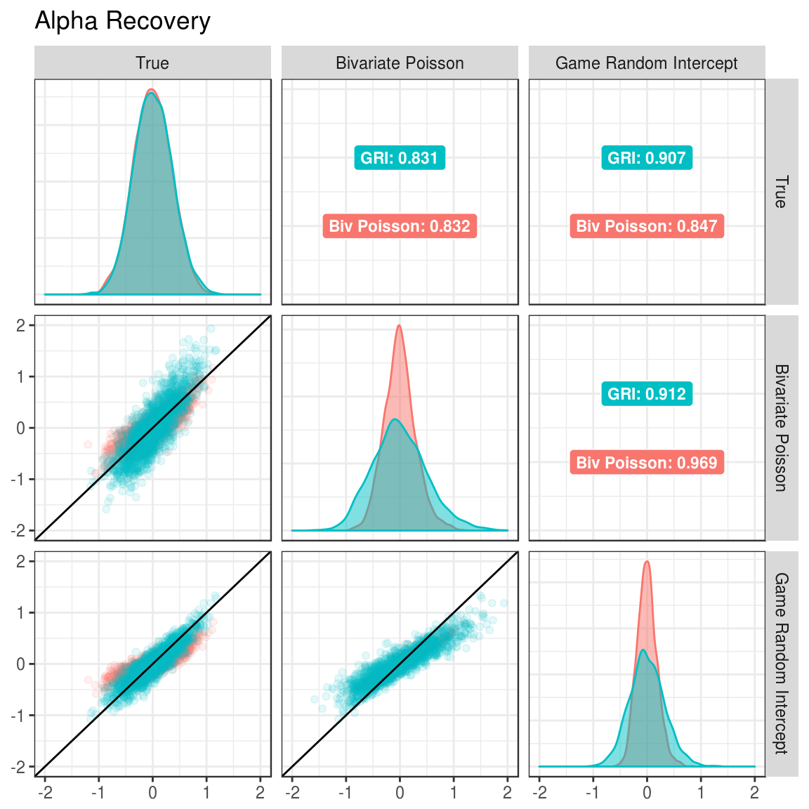

# Simulation Study {#simulation}

In order to evaluate these two models, I conducted a small scale simulation study. I generated 100 data sets from each of the bivariate Poisson and game random intercept models (for 200 data sets total). For each data set, both of the models were estimated to determine how well they were able to recover the attacking and defensive parameters for each team when the data generating model did and did not match the model.

## Data generation

Data was simulated to mimic the major domestic European leagues. For each data set, 20 clubs were generated, with each club playing all other clubs twice, once at home, and once away, for a total of 380 games.

For both data generating models, $\alpha$ and $\delta$ parameters were drawn from a $\mathcal{N}(0,0.35)$. Both $\rho$ in the bivariate Poisson and $\gamma$ in the game random intercept model were sampled from a $\mathcal{N}(0,0.1)$ distribution. For all models, $\mu$ was set to 0, and $\eta$ was set to 0.5. These distributions were based on preliminary analyses using the 2015-16 English Premier League data.

For each game, $\lambda$ values were calculated based on the parameters that were generated for each team (and game for the game random intercept model). Scores were then randomly generated using the `rpois()` function. Full data generation functions can be see in Appendix \@ref(bivpois-generate) and \@ref(gri-generate). When simulating the data sets, the **portableParallelSeeds** package was used to ensure that the data generation was completely replicable, and that the random number streams were not overlapping [@R-portableParallelSeeds].

## Model estimation {#model-est}

In total, 200 data sets were generated: 100 from the bivariate Poisson, and 100 from the game random intercept model. For each data set, both the bivariate Poisson and game random intercept model were estimated. Thus, each model was estimated 100 times on a data set from the matching data generation method, and 100 times on mismatched data.

For each estimation, 2 chains were run with 15000 iterations. The first 5000 iterations of each chain were discarded for burn-in. This resulted in a total of 20000 retained iterations that made up the final posterior distributions. The thinning interval was set to 1 (no thinning). Finally, the target proposal acceptance rate during the adaptation period was set to 0.99. This forces the algorithm to take smaller steps, which decreases efficiency. However, this also helps to eliminate divergent transitions, which are common when parameter estimates are close to their bounds, such as a variance very close to 0 [@stan; @stanwarn]. The full model estimation function can be seen in Appendix \@ref(estimate-fun).

## Running the simulation

The following code was used to run the simulation. I first define the total number of replications and the number of random streams needed for each replication. I then use **portableParallelSeeds** [@R-portableParallelSeeds] to create seeds for each replication, and save them. Data sets are then generated from each model, with the number of data sets from each model being equal to half of the total number of replications specified by `n_reps`. Finally, I create one list that contains all of the data sets, `simulation_data`, and map the simulation function to each element of that list using the **purrr** package [@R-purrr].


```r
# Define parameters for the simulation
n_reps <- 200
streams_per_rep <- 1

# Create the seed warehouse
project_seeds <- seedCreator(n_reps, streams_per_rep, seed = 9416)
save(project_seeds, file = "_data/simulation_seeds.rda")

# Create data sets
bivpois_data <- lapply(X = 1:(n_reps / 2), FUN = generate_bivpois,
  seeds = project_seeds, num_club = 20)
gri_data <- lapply(X = ((n_reps / 2) + 1):n_reps, FUN = generate_gri,
  seeds = project_seeds, num_club = 20)

simulation_data <- c(
  bivpois_data,
  gri_data
)

simulation <- map_df(.x = simulation_data, .f = simulation_fun)
save(simulation, file = "_data/simulation.rda")
```

## Simulation results {#sim-results}

### Correlation between true and estimated parameters {#sim-corr}


To assess the bivariate Poisson and game random intercept models, I first examine the correlations between the true parameters and the estimated parameters from each model. The parameters for each replication can be pulled out of the simulation results using the **purrr** and **dplyr** packages [@R-purrr; @R-dplyr]. The **plyr** package will be used later but, for compatibility reasons, needs to be loaded before **dplyr**.


```r
library(plyr)
library(dplyr)
library(purrr)

plot_sim <- simulation %>%
  select(generator, true_params, bivpois_params, gri_params) %>%
  as.list() %>%
  pmap_df(.l = ., .f = function(generator, true_params, bivpois_params,
    gri_params) {
      data_frame(
        generator = generator,
        true_alpha = true_params$attack,
        true_delta = true_params$defend,
        bivpois_alpha = bivpois_params$bivpois_alpha,
        bivpois_delta = bivpois_params$bivpois_delta,
        gri_alpha = gri_params$gri_alpha,
        gri_delta = gri_params$gri_delta
      )
    })
```

I then use the **GGally** package [@R-GGally], an extension of **ggplot2** [@R-ggplot2] to plot a scatter plot matrix with correlations. I use the `round_any()` function from the **plyr** package [@R-plyr] to set the limits on the axes. The functions to create the lower and upper triangles and the diagonal of the scatter plot matrix (`lowerFn()`, `upperFn()`, and `diagFn()` respectively) can be found in Appendix \@ref(ggally-comp), and the code to put the plots together can be found in Appendix \@ref(ggally-plot).


<div class="figure" style="text-align: center">

<p class="caption">(\#fig:alpha-cor)Correlation between true and estimated alpha parameters under different generating and estimated models.</p>
</div>

<div class="figure" style="text-align: center">

<p class="caption">(\#fig:delta-cor)Correlation between true and estimated delta parameters under different generating and estimated models.</p>
</div>

In the Figures \@ref(fig:alpha-cor) and \@ref(fig:delta-cor), the margins show which model was estimated. The upper triangle shows the correlations between the estimated parameters for the model and the true parameters under each of the data generation conditions. For example, when estimating the alpha parameters with the bivariate Poisson (Figure \@ref(fig:alpha-cor)), the correlation between estimated parameters and true parameters is 0.831 when the data was generated with the GRI model and 0.832 when generated with the bivariate Poisson model.

When looking at Figures \@ref(fig:alpha-cor) and \@ref(fig:delta-cor), the correlation between true and estimated parameters is higher when the game random intercept model is used for estimation compared to the bivariate Poisson. This is true when the game random intercept model is used to generate data (0.907 to 0.831 for alpha and 0.903 to 0.821 for delta) and when the bivariate Poisson model is use for data generation (0.847 to 0.832 for alpha and 0.861 to 0.849 for delta). Thus, this provides preliminary evidence that the game random intercept model should be preferred.

### Estimation bias and mean square error {#sim-bias-mse}

It is also useful to look at the average bias and mean squared error of the estimates from each model. Table \@ref(tab:bias-table) shows the average bias in the estimates for alpha and delta (calculated as $estimate - true$).


```r
simulation %>%
  select(`Data Generator` = generator, bivpois_alpha_bias, bivpois_delta_bias,
    gri_alpha_bias, gri_delta_bias) %>%
  group_by(`Data Generator`) %>%
  summarize(
    `Bivariate Poisson: Alpha` = sprintf("%.3f", mean(bivpois_alpha_bias)),
    `Bivariate Poisson: Delta` = sprintf("%.3f", mean(bivpois_delta_bias)),
    `Game Random Intercept: Alpha` = sprintf("%.3f", mean(gri_alpha_bias)),
    `Game Random Intercept: Delta` = sprintf("%.3f", mean(gri_delta_bias))
  ) %>%
  mutate(`Data Generator` = factor(`Data Generator`, levels = c("bivpois", "gri"),
    labels = c("Bivariate Poisson", "Game Random Intercept"))) %>%
  knitr::kable(caption = "Estimation bias for alpha and delta parameters.")
```


Table: (\#tab:bias-table)Estimation bias for alpha and delta parameters.

Data Generator          Bivariate Poisson: Alpha   Bivariate Poisson: Delta   Game Random Intercept: Alpha   Game Random Intercept: Delta 
----------------------  -------------------------  -------------------------  -----------------------------  -----------------------------
Bivariate Poisson       0.001                      -0.012                     0.001                          -0.012                       
Game Random Intercept   -0.010                     -0.003                     -0.010                         -0.002                       

The bias is nearly identical across estimation models, regardless of which model was used for data generation. Further, all of the biases are very close to 0, indicating that neither model significantly biases the estimates in a positive or negative way.

Table \@ref(tab:mse-table) shows the average mean square error in the estimates for alpha and delta (calculated as $(estimate - true)^2$).


```r
simulation %>%
  select(`Data Generator` = generator, bivpois_alpha_mse, bivpois_delta_mse,
    gri_alpha_mse, gri_delta_mse) %>%
  group_by(`Data Generator`) %>%
  summarize(
    `Bivariate Poisson: Alpha` = sprintf("%.3f", mean(bivpois_alpha_mse)),
    `Bivariate Poisson: Delta` = sprintf("%.3f", mean(bivpois_delta_mse)),
    `Game Random Intercept: Alpha` = sprintf("%.3f", mean(gri_alpha_mse)),
    `Game Random Intercept: Delta` = sprintf("%.3f", mean(gri_delta_mse))
  ) %>%
  mutate(`Data Generator` = factor(`Data Generator`, levels = c("bivpois", "gri"),
    labels = c("Bivariate Poisson", "Game Random Intercept"))) %>%
  knitr::kable(caption = "Estimation mean square error for alpha and delta parameters.")
```


Table: (\#tab:mse-table)Estimation mean square error for alpha and delta parameters.

Data Generator          Bivariate Poisson: Alpha   Bivariate Poisson: Delta   Game Random Intercept: Alpha   Game Random Intercept: Delta 
----------------------  -------------------------  -------------------------  -----------------------------  -----------------------------
Bivariate Poisson       0.038                      0.037                      0.046                          0.049                        
Game Random Intercept   0.083                      0.069                      0.022                          0.022                        

As would be expected, there is more error associated with estimates coming from a model that doesn't match the data generating model. However, comparatively, there is less error associated with the game random intercept model. When the estimation model matches the generation model, the game random intercept model has mean square error values of 0.022 and 0.022 for alpha and delta parameters respectively. The bivariate Poisson model has mean square error values of 0.038 and 0.037 for these same parameters. Similarly, the game random intercept model also shows lower error when the estimation model doesn't match the generation model. The game random intercept model has mean square error values for alpha and delta of 0.046 and 0.049 when the bivariate Poisson generated the data, whereas the bivariate Poisson has mean square error values for alpha and delta of 0.083 and 0.069 when the game random intercept model generated the data.

These results indicate that the best choice of model would be the one that matches the data generation process. Unfortunately, when using real data, the exact data generation process is impossible to know. However, these findings also show that the cost of being wrong is much less when using the game random intercept model to estimate, compared to the bivariate Poisson model.

## Summary of findings {sim-concl}

The findings from the simulation study indicate that the game random intercept model should be the preferred model for estimating the abilities of soccer teams. Across data generating models, the game random intercept model was better able to recover the true parameters (Section \@ref(sim-corr)). Additionally, the game random intercept model had comparable bias and lower mean square error than the the bivariate Poisson model (Section \@ref(sim-bias-mse)).

Therefore, I will be using the game random intercept model moving forward for estimating the model on real data and predicting future games.
